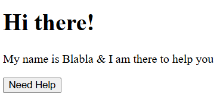

# Practice Questions

## Qn 1.

Write CSS for these elements according to the given style guidelines:



- h2 : Orange text
- button : Blue background color and white text color
- p : Black background color and white text color

## Qn 2.

Write the hexcode equivalent to rgb(255, 255, 255) and tell what color is it.

**Ans:** #ffffff (White color)

## Qn 3.

Design the given image using CSS instructions:


- Set the font-family to sans-serif
- Set the color of text to #ffa511
- Center align the text
- make the text size 55px and font-weight 900
- Set spacing between latters to 2px
- Set the line height to 1.5x the normal value
- Add a teal double underline
- Uppercase all the letters only using CSS (Use Google)

## Write CSS for the following code:

```html
<!DOCTYPE html>
<html lang="en">
    <head>
        <meta charset="UTF-8">
        <meta name="viewport" content="width=device-width, initial-scale=1.0">
        <link rel="stylesheet" href="style.css">
        <title>Document</title>
    </head>
    <body>
        <!--Poem Name-->
        <h1>Ozymandias</h1>
        <!--Poet's Name-->
        <h3>by Percy Bysshe Shelley</h3>
        <!--Poem-->
        <p>
            I met a traveller from an antique land,<br>
            Who said—“Two vast and trunkless legs of stone<br>
            Stand in the desert.... Near them, on the sand,<br>
            Half sunk a shattered visage lies, whose frown,<br>
            And wrinkled lip, and sneer of cold command,<br>
            Tell that its sculptor well those passions read<br>
            Which yet survive, stamped on these lifeless things,<br>
            The hand that mocked them, and the heart that fed;<br>
            And on the pedestal, these words appear:<br>
            My name is Ozymandias, King of Kings;<br>
            Look on my Works, ye Mighty, and despair!<br>
            Nothing beside remains. Round the decay<br>
            Of that colossal Wreck, boundless and bare<br>
            The lone and level sands stretch far away.”<br>
        </p>
        <hr>
        <h4> Read up  more about the poem on<a href="https://en.wikipedia.org/wiki/Ozymandias">Wikipedia</a></h4>
        <textarea  placeholder="Leave your comments here..."></textarea>
        <br><br>
        <button>Comment</button>
    </body>
</html>
```

### Qn 4.

Set the background page to color “wheat”, by using an inline style.

### Qn 5.

Change the color of the poem in the page to brown (use the hex code for color).

### Qn 6.

Align all the headings & the poem to the center of the page.

### Qn 7.

Change the color of the poem name to red & the poet’s name to black.

### Qn 8.

Change the font of the entire document to the font-Georgia.

### Qn 9.

Set the color of the Wikipedia link to green & remove its underline (use the rgb value for color).

### Qn 10.

Change the button background color to white & button text to blueviolet.

### Qn 11.

What is the hex code for black color? Set the text area font color to black.

### Qn 12.

Set the poem’s line-height to 30px.

### Qn 13.

Underline only the word Ozymandias inside the poem.
