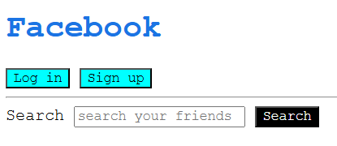

# Practice Questions

## Qn 1.

Implement the following CSS for the [HTML document](ans1/index.html) to recreate the image shown below..



- Set font family of entire document to Courier new
- Set text color for all h1 headings to #1b74e4
- Set background color of search button to black and text color to white
- Set background color of login and signup button to aqua.

## Qn 2.

Write CSS statement to implement the following:

- Set the color paragraphs inside divs with the id "my-id" to green

## Qn 3.

For the given HTML and CSS code, what will be the color of the text 'Hello World!' ?

```html
<div id="main" class="box">
    <p class="text" id="title">Hello World!</p>
</div>
```

```css
#main .text {
    color: red;
}

.box #title {
    color: blue;
}

p#title {
    color: green;
}

.text {
    color: orange !important;
}

#title {
    color: purple;
}
```

**Ans:** The text color of 'Hello World!' will be orange 🟠.

## Write CSS for the following code:

```html
<!DOCTYPE html>
<html lang="en">
<head>
    <meta charset="UTF-8">
    <meta name="viewport" content="width=device-width, initial-scale=1.0">
    <title>Document</title>
    <link rel="stylesheet" href="style.css">
</head>
<body>
    <h1 id="main-topic">CSS Practice</h1>
    <h3>Let's learn about selectors.</h3>
    <!--Paragraph 1-->
    <p class="content">There are multiple selectors in css.</p>
    <!--Paragraph 2-->
    <p class="content">Some of them include class selector, id selector etc </p>
    <!--Paragraph3-->
    <p class="content">And we can also combine these too.</p>
        <div>
            <h5> Did you like the practice set?</h5>
            <input type="checkbox" id="yes"/>
            <label for="yes">Yes</label>
            <br>
            <button>Learn next!</button>
        </div>
</body>
</html>
```

### PART A (Selectors)

#### Qn 4.

Give the h1 header a unique id - "main-topic" & set its color to blue using the id selector.

#### Qn 5.

Align all the text in the page to the center using a universal selector.

#### Qn 6.

Change the font style of all heading tags in the page to ‘Georgia’.

#### Qn 7.

Set the color of all the paragraphs to white & background color to cornflowerblue. (Without using the element selector - ‘p’)

#### Qn 8.

Select all buttons inside div and change their background color to purple & text color to azure.

### PART B (Pseudo class & elements)

#### Qn 9.

Change the button background color to yellow & text color to blue when we hover over it.

#### Qn 10.

Change the color of every odd numbered paragraph to yellow. (Paragraph 1 & 3)

#### Qn 11.

Change the color of the first letter of h1 heading to red.

#### Qn 12.

Set the text color of the check box label to dark green when the check box is ticked.

## Qn 13.

Order these rules according to their specificity, from least specific to most specific.

- h1
- #main-content
- .main
- div .main

**Ans:** `#main-content` > `div .main` > `.main` > `h1`