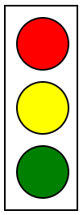

# Practice Questions

## Qn 1.

Recreate the given image:

- Create a div & 3 sibling divs inside it
- for the outer div set following styling
    * height 200px, width 70px, and border 2px solid black color

- For the outer divs set following styling
    * height 50px, width 50px, and border 2px solid black color
    * Also set margin 10px
    * Make inner divs circular in shape and give them individual colors (red, yellow, and green)

## Qn 2.

Create a box using div.

Set

- Its height to 150px, width to 300px and the background color to grey.
- Border to a 5px, black, dotted border.
- A top margin of 20px.
- A right margin of 1em.
- A bottom margin of 40px.
- A left margin of 2em.
- Padding on all sides of 1em.

## Qn 3.

Create 3 divs with the following properties

- Height & Width of 100px
- Background color to pink 
- Border to 2px solid black
- Make this div in the shape of circle
- Place all the 3 divs in a single line

## Qn 4.

Create a list of technologies - HTML, CSS, JavaScript, NodeJS, ReactJS, SQL, MongoDB, Java, C++, C & Python.

Now change the display of all list items to inline to move them all in a single line.

Did you notice something different? Try to find why the bullet points disappear.