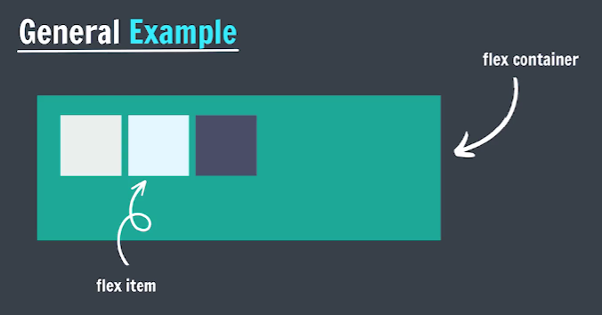

# Flex Box

Flexible Box Layout

It is a one-dimensional layout method for arranging items in rows or columns.

[Flexbox Cheat sheet](flowbox-summary.pdf)

In a flex layout, you apply the display property with a value of flex or inline-flex to an element to define it as a flex container. This enables a flex context for all its direct children, known as flex items.

```css
container {
display: flex;          /* Turns element into a flex container */
display: inline-flex;   /* Inline version of flex container */
}
```



## flex-direction

It sets flex items are placed in the flex container, along which axis and direction.

```css
flex-direction: row;            /* Items in a row (left to right) */
flex-direction: row-reverse;    /* Items in a row (right to left) */
flex-direction: column;         /* Items in a column (top to bottom) */
flex-direction: column-reverse; /* Items in a column (bottom to top) */
```

## justify-content

Tells how the browser distributed space between and around content items along the main axis.

```css
justify-content: flex-start;    /* Items at start */
justify-content: flex-end;      /* Items at end */
justify-content: center;        /* Items in center */
justify-content: space-between; /* Equal space between items */
justify-content: space-around;  /* Equal space around items */
justify-content: space-evenly;  /* Equal space including edges */
```

## flex-wrap

Sets whether flex items are forced onto one line or can wrap onto multiple lines.

```css
flex-wrap: nowrap;       /* All items on one line */
flex-wrap: wrap;         /* Items wrap to next line */
flex-wrap: wrap-reverse; /* Items wrap upward */
```

## align-items

Distributes items along the cross axis.

```css
align-items: flex-start;    /* Items at top */
align-items: flex-end;      /* Items at bottom */
align-items: center;        /* Items vertically centered */
align-items: baseline;      /* Items align by text baseline */
```

## align-content

It sets the distribution of space between and around content items along a flexbox's cross axis.

```css
align-content: flex-start;    /* Rows at top */
align-content: flex-end;      /* Rows at bottom */
align-content: center;        /* Rows centered */
align-content: space-between; /* Equal space between rows */
align-content: space-around;  /* Equal space around rows */
align-content: space-evenly;  /* Equal space including edges */
align-content: baseline;      /* Items aligned by their baseline */
```

## align-self

Align an item along the cross axis.

```css
/* align-self: Overrides align-items for a single flex item */

align-self: flex-start; /* This item at top */
align-self: flex-end;   /* This item at bottom */
align-self: center;     /* This item centered */
align-self: baseline;   /* This item aligns by text baseline */
```

## Flex Sizing

### flex-basis

It sets the initial main size of a flex item.

```css
flex-basis: 100px;
```

### flex-grow

It specifies how much of the flex container's remaining space should be assigned to the flex item's main size

```css
flex-grow: 1;
```

### flex-shrink

It sets the flex shrink factor of a flex item.

```css
flex-shrink: 1;
```

### Shorthand Syntax

- flex-grow | flex-shrink | flex-basis

    ```css
    flex: 2 2 100px;
    ```

- flex-grow | flex-basis

    ```css
    flex: 2 100px;
    ```

- flex-grow (unitless)

    ```css
    flex: 2;
    ```

- flex-basis

    ```css
    flex: 100px;
    ```
