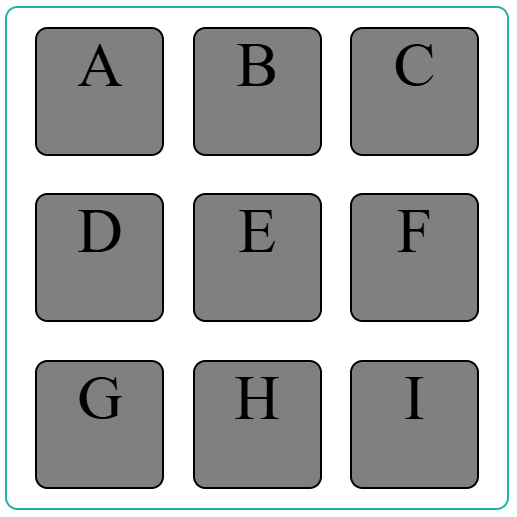
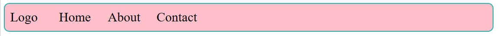

# Practice Questions

## Qn 1.

Recreate the following layout using flexbox as closely as possible:

- Take the container height and width as 400px and child height and width as 100 px.
- Font size of text 50px.

## Qn 2.

Recreate the following layout using flexbox as closely as possible:

## Qn 3.

Try solving a few Flexbox based games here: [Flexbox Adventure Game](https://codingfantasy.com/games/flexboxadventure)
