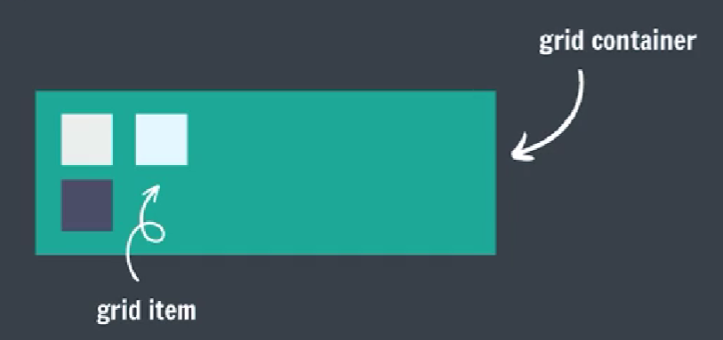
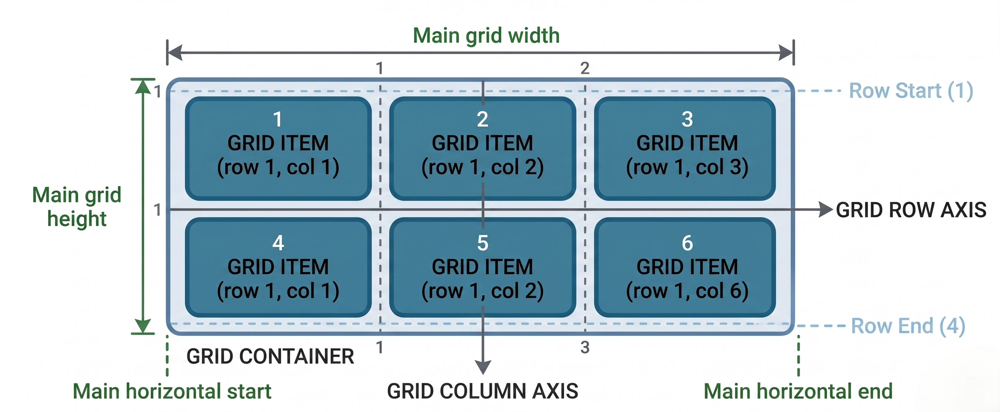

## CSS Grid

Setting a container's display to grid will make all children grid items.

```css
container {
    display: grid;        /* Makes container a block-level grid */
    display: inline-grid; /* Makes container an inline-level grid */
}
```

**General Example:** <br> 

<br>

**Grid Model:** <br> 

- **Grid Lines:** Vertical/horizontal dividing lines.
- **Grid Tracks:** Spaces between two grid lines (rows or columns).
- **Grid Cells:** Smallest unit where a row track and column track intersect.

### Grid Template

Defines the lines & track sizing (rows and columns).

```css
grid-template-rows: 50px 50px 50px;       /* Creates 3 rows, each 50px tall */
grid-template-columns: 100px 100px 100px; /* Creates 3 columns, each 100px wide */
```

- **Grid Template with repeat function**

    Repeat is used to distribute available space evenly.
    
    ```css
    grid-template-rows: repeat(count, 1fr);    /* 'fr' = fraction of available space */
    grid-template-columns: repeat(count, 1fr); /* Repeats columns 'count' times */

    grid-template-rows: repeat(3, 1fr);        /* Creates 3 equal-height rows */
    grid-template-rows: 1fr 1fr 1fr;           /* Same as above, written manually */
    ```

### Grid Gaps

They define the gaps between the lines.

```css
row-gap: 10px;              /* Gap between rows */
column-gap: 20px;           /* Gap between columns */

grid-gap: 10px;      /* Same gap for rows and columns */
grid-gap: 10px 20px; /* Row gap 10px, Column gap 20px */
```

### Grid Columns

Defines an item's starting & ending position inside the column.

```css
grid-column-start: line_number;        /* Starting vertical line */
grid-column-end: line_number;          /* Ending vertical line */

grid-column: start_col / end_col;      /* Shorthand: start / end column lines */
grid-column: start_col / span number;  /* Start column, span across 'number' columns */
```

### Grid Rows

Defines an item's starting & ending position inside the row.

```css
grid-row-start: line_number;         /* Starting horizontal line */
grid-row-end: line_number;           /* Ending horizontal line */

grid-row: start_row / end_row;         /* Shorthand: start / end row lines */
grid-row: start_row / span number;     /* Start row, span across 'number' rows */
```

### Grid Alignment Properties

```css
/* Grid Alignment - Where items sit inside their cell */

/* CONTAINER properties (affects ALL items) */
justify-items: start;    /* Items align to LEFT */
justify-items: center;   /* Items align to CENTER */
justify-items: end;      /* Items align to RIGHT */

align-items: start;      /* Items align to TOP */
align-items: center;     /* Items align to MIDDLE */
align-items: end;        /* Items align to BOTTOM */

/* SINGLE ITEM properties (overrides container for one item) */
justify-self: start / center / end / stretch;  /* Horizontal alignment */
align-self: start / center / end / stretch;    /* Vertical alignment */
```

## CSS Animations

To animate CSS elements.

```css
/* Keyframes define the animation sequence */
@keyframes animationName {
    from { font-size: 20px; }  /* Starting state (0% of animation) */
    to { font-size: 40px; }    /* Ending state (100% of animation) */
}
```

```css
/* Animation Properties */
animation-name                   /* Which keyframe to use */
animation-duration               /* How long animation lasts (e.g., 2s, 500ms) */
animation-timing-function        /* Speed curve: ease, linear, ease-in, etc. */
animation-delay                  /* Delay before animation starts */
animation-iteration-count        /* How many times: 1, 2, infinite */
animation-direction              /* Direction: normal, reverse, alternate, alternate-reverse */
```

### Animation Shorthand

```css
/* Order: name duration timing-function delay iteration-count direction */
animation: animationName 2s linear 3s infinite normal;
```

### % in Animation

```css
/* Percentages in Animation (more precise control) */
@keyframes myName {
    0%   { font-size: 20px; }   /* Start position */
    50%  { font-size: 30px; }   /* Middle of animation */
    100% { font-size: 40px; }   /* End position */
}
```

## Media Queries

Help create a responsive website.

```css
/* Media Feature: Width (of viewport) */
@media (max-width: 400px) {      /* Applies only when viewport ≤ 400px wide */
    div {
        background-color: red;   /* Turns background red on small screens */
    }
}

/* Applies styles when viewport width is BETWEEN 200px and 400px */
@media (min-width: 200px) and (max-width: 400px) {
    h1 {
        background-color: lightcoral;  /* Changes h1 background to lightcoral */
    }
}
```

```css
/* Media Feature: Orientation (of viewport) */
@media (orientation: landscape) { /* Applies when width > height (landscape mode) */
    div {
        background-color: red;    /* Turns background red in landscape */
    }
}
```

## z-index

Decides the stack level of elements.

Overlapping elements with a larger z-index cover those with smaller one.

```css
z-index: auto;          /* Default value = 0, no stacking context created */

/* z-index - Stack order (which element sits on top) */
z-index: 1;    /* Higher number = appears on top */
z-index: -1;   /* Negative number = goes behind */
```

> [!NOTE]
> z-index works ONLY on positioned elements (relative, absolute, fixed, sticky). NOT on static (default).
