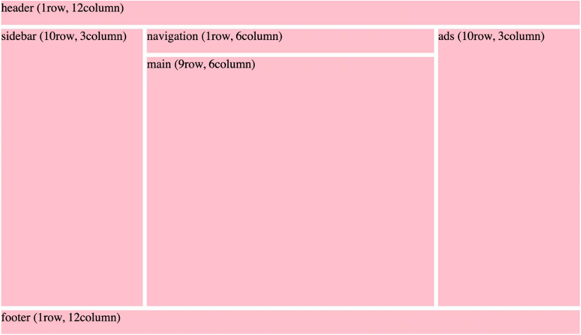
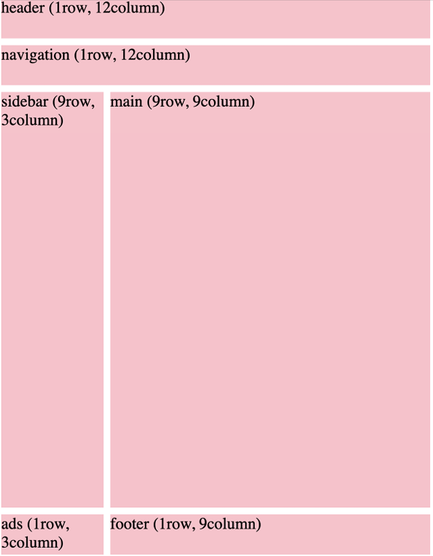

# Practice Questions

## Qn 1.

Create the following layout using CSS Grid:



- Divide the grid into 12 rows and 12 columns
- Give a gap of 10px between each row and column
- Set the sizing of individual boxes as shown in the image

## Qn 2.

Use Media Queries to change the above layout to the one given below when the viewport width goes below 720px



## Qn 3.

Try to complete this code to create a web page loader using CSS animations.

 <br>

```html
<!DOCTYPE html>
<html lang="en">
<head>
    <meta charset="UTF-8">
    <meta name="viewport" content="width=device-width, initial-scale=1.0">
    <title>Document</title>
    <link rel="stylesheet" href="style.css">
</head>
<body>
    <h1>Loader</h1>
    <div class="loader"></div>
</body>
</html>
```

```css
.loader {
    border: 16px solid #f3f3f3;
    border-top: 16px solid goldenrod;
    border-radius: 50%;
    width: 120px;
    height: 120px;
    animation: spin 2s linear infinite;
}

@keyframes spin {
    0% {
        /*Set rotation to 0 degrees*/
    }
    100% {
        /*Set rotation to 360 degrees*/
    }
}
```
