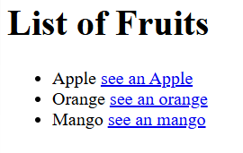

# Practice Questions

## Qn 1.

Create an unordered list of 3 fruits - apple, orange and mango that also shows links to their pictures.



## Qn 2.

Create a portfolio page.

- Add name and picture on top.
- Add sections for education, skills, hobbies and contact.

## Qn 3.

Use the correct HTML tag to add a paragraph with the text "Hello World!".

## Qn 4.

Mark up the text with appropriate tags:

- "Bla" is the most important heading.
- "Blabla" is the next most important heading.
- "Blablabla" is the third most important heading.
- The last sentence "Blah blah blah blah!" is just a paragraph.
- Start with the most important heading (the largest) and end with the least important heading (the smallest).

## Qn 5.

Create a clickable link that redirects to the url: https://www.java.com/en/

## Qn 6.

You are given the rank list of few students, create an ordered HTML list to display the list given below:

```text
1. Nick
2. Ria
3. Sam
4. Geo
5. Ann
```
