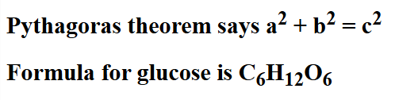
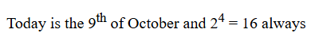

# Practice Questions

## Qn 1.

Print the following on the screen using `<h1>` heading element.

## Qn 2.

Print the following on the screen using `<h1>` heading element and entities.

## Qn 3.

Print the following using HTML tags.

## Qn 4.

Print the symbol for copyright & trademark on your web page.

## Qn 5.

Add a video element with controls and a poster image.
