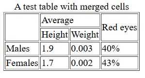
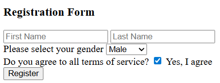
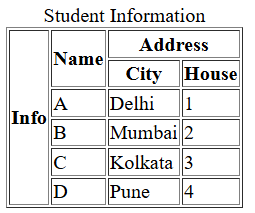
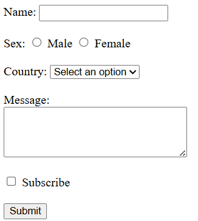
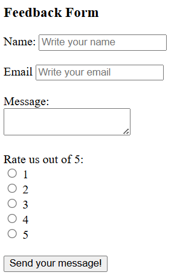

# Practice Questions

## Qn 1.

Recreate the following table using HTML.

## Qn 2.

Create a search option that redirects its search request to Google.

## Qn 3.

Recreate the following form with suitable elements and input types.

## Qn 4.

Recreate the following table using HTML.

## Qn 5.

Recreate the following form using HTML.

## Qn 6.

Recreate the following form using HTML.

