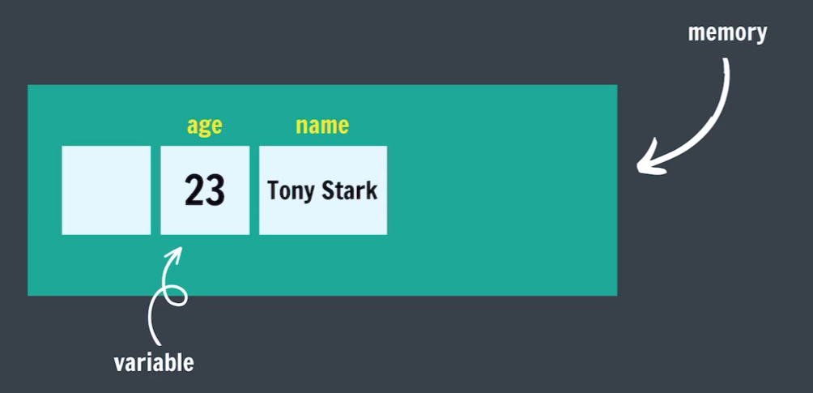

# JavaScript

JavaScript (JS) is a high-level programming language used primarily for creating interactive and dynamic features on websites, working alongside HTML and CSS. It allows developers to implement complex functionalities like animations, form validation, and real-time content updates.

## Using the Console

Uses REPL

REPL: Read-Evaluate-Print Loop

A REPL is an interactive programming environment that takes single user inputs, reads them, evaluates them, prints the result, and then loops back for more input.

## What is a Variable?

A variable is simply the name of a storage location.



## Data Types

| Primitive Types |
|-----------------|
| Number          |
| Boolean         |
| String          |
| Undefined       |
| Null            |
| BigInt          |
| Symbol          |

### Numbers

- positive (14) & Negative (-4)
- Integers (45, -50)
- Floating numbers - with decimal (4.6, -8.9)

### Boolean

Boolean represents a truth value -> true or false / yes or no

```js
let age = 23;
let isAdult = true;

age = 13;
isAdult = false;
```

### String

Strings are text or sequence of characters.

```js
let name = "Tony Stark";
let role = "IronMan";
let char = 'a';
let num = '23';
let empty = "";

let sentence1 = 'this is "apple"';
let sentence2 = "this is 'orange'";
```

- **String Indices**

    JS is a 0 based indexing programming language.


    ```js
    let name ="TONY STARK"

    name[0];    // T
    name[5];    // S
    name[1000]; // undefined

    name.length; // 10

    name[name.length-1]; // K
    ```

- **Concatenation**

    Adding strings together

    ```js
    let firstName = "Tony";
    let lastName = "Stark";
    let fullName = firstName + " " + lastName; // Tony Stark
    ```

### null & undefined

- **undefined**: A variable that has not been assigned a value is of type undefined.

    ```js
    let a; // undefined
    ```

- **null**: The null value represents the intentional absence of any object value.

    To be explicitly assigned.

    ```js
    let a = null; // null
    ```


### Checking Type: typeof

```js
let num = 42;
let str = "hello";
let bool = true;
let undef;
let empty = null;

typeof num;   // "number"
typeof str;   // "string"
typeof bool;  // "boolean"
typeof undef; // "undefined"
typeof empty; // "object" (JS bug)
```

## Operators

### Arithmetic Operators

```js
a = 20;
b = 10;

// Addition
sum = a + b;

// Subtraction
diff = a - b;

// Multiplication
prod = a * b;

// Division
div = a / b;

// Modulo
rem = a % b;

// Power
pow = a ** b;
```

- Modulo (remainder operator) `12 % 5 = 2`
- Exponentiation (power operation) `2**3 = 8`

### NaN

The NaN global property is a value representing **Not-A-Number**.

```js
0 / 0;     // NaN

NaN - 1;   // NaN

NaN * 1;   // NaN

NaN + NaN; // NaN
```

### Operator Precedence

Order of solving an expression (highest to lowest):

| Precedence | Operators | Description |
|------------|-----------|-------------|
| 1 | `( )` | Parentheses (grouping) |
| 2 | `**` | Exponentiation (power) |
| 3 | `*`, `/`, `%` | Multiplication, Division, Modulo |
| 4 | `+`, `-` | Addition, Subtraction |

**Example:**
```js
let result = 10 + 5 * 2;    // 20 (not 30)
let result2 = (10 + 5) * 2; // 30 (parentheses override)
```

### Assignment Operators

```js
age = age + 1;
age += 1;

age = age - 1;
age -= 1;

age = age * 1;
age *= 1;
```

### Unary Operators

```js
age = age + 1;
age += 1;
age++ // Unary increment (POST-increment)

age = age - 1;
age -= 1;
age-- // Unary decrement (POST-decrement)
```

- **Pre-increment** (Change, then use)

    ```js
    let age = 10;
    let newAge = ++age;

    // Step-by-step:
    // 1. ++age increases age to 11 FIRST
    // 2. newAge = 11
    // 3. age is now 11
    ```

- **Post-increment** (use, then change)

    ```js
    let age = 10;
    let newAge = age++;

    // Step-by-step:
    // 1. age++ gives current value (10) to newAge FIRST
    // 2. newAge = 10
    // 3. THEN age increases to 11
    ```

- **Pre-decrement** (Change, then use)

    ```js
    let age = 10;
    let newAge = --age;

    // Step-by-step:
    // 1. --age decreases age to 9 FIRST
    // 2. newAge = 9
    // 3. age is now 9
    ```

- **Post-decrement** (use, then change)

    ```js
    let age = 10;
    let newAge = age--;

    // Step-by-step:
    // 1. age-- gives current value (10) to newAge FIRST
    // 2. newAge = 10
    // 3. THEN age decreases to 9
    ```
    
## let, const, and var Keywords 

### let keyword

Syntax of declaring variables.

```js
let age = 23;
age = age + 1; // 24

let num1 = 1;
let num2 = 2;
let sum = num1 + num2; // 3
```

### const Keyword

Values of constants can't be changed with re-assignment & they can't be re-declared.

```js
const year = 2025;
year = 2026;     // TypeError: Assignment to constant variable
year = year + 1; // TypeError: Assignment to constant variable

const pi = 3.14;
const g = 9.8;
```

### var Keyword

Old Syntax of writing variables.

```js
var age = 23;

var num1 = 1;
var num2 = 2;
var sum = num1 + num2;
```

## Identifier Rules

All JavaScript variables must be identified with unique names (identifiers).

- Names can contain letters, digits, underscores, and dollar signs. (no space)
- Names must begin with a letter.
- Names can also begin with $ and _.
- Names are case sensitive (y and Y are different variables).
- Reserved words (like javaScript keywords) CANNOT be used as names.

### camelCase

Way of Writing identifiers

- camelCase (JS naming convention)
- snake_case
- PascalCase

## What is TypeScript

TypeScript is a superset of JavaScript that adds static typing, while JavaScript is dynamically typed, developed and maintained by Microsoft.