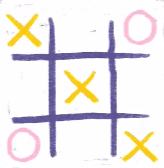

# Practice Questions

## Qn 1.

For the given string:

`let msg = "Help!";`

Trim it and convert it to uppercase.

## Qn 2.

For the string `let name = "JavaScript";`, what is the output for following:

- `name.slice(4, 10);`
- `name.indexOf("va");`
- `name.replace("Java", Type)`

Separate the "Script" part in the above string & replace 'T' with 'H' in it.

## Qn 3.

For the given start state of an array, change it to final form using `shift() and unshift()` method.

start: `['January', 'July', 'March', 'August']`

final: `['July', 'June', 'March', 'August']`

## Qn 4.

For the given start state of an array, change it to final form using `splice()` method.

start: `['January', 'July', 'March', 'August']`

final: `['July', 'June', 'March', 'August']`

## Qn 5.

Return the index of the "JavaScript" from the given array, if it was reversed.

`['C', 'CPP', 'HTML', 'JavaScript', 'Python', 'Java', 'C#', 'SQL']`

## Qn 6.

Create a nested array to show the following tic-tac-toe game state.

## Qn 7.

Write a JavaScript program to get the first `n` elements of an array. [n can be any positive number].

For example: for array `[7,9,0,-2]` and `n = 3` Print, `[7,9,0]`

## Qn 8.

Write a JavaScript program to get the last `m` elements of an array. [m can be any positive number].

For example: for array `[7,9,0,-2]` and `m = 3` Print, `[9,0,-2]`

## Qn 9.

Write a JavaScript program to check whether a string is blank or not.

## Qn 10.

Write a JavaScript program to test whether the character at the given (character) index is lowercase.

## Qn 11.

Write a JavaScript program to strip leading and trailing spaces from a string.

## Qn 12.

Write a JavaScript program to check if an element exists in an array or not.
